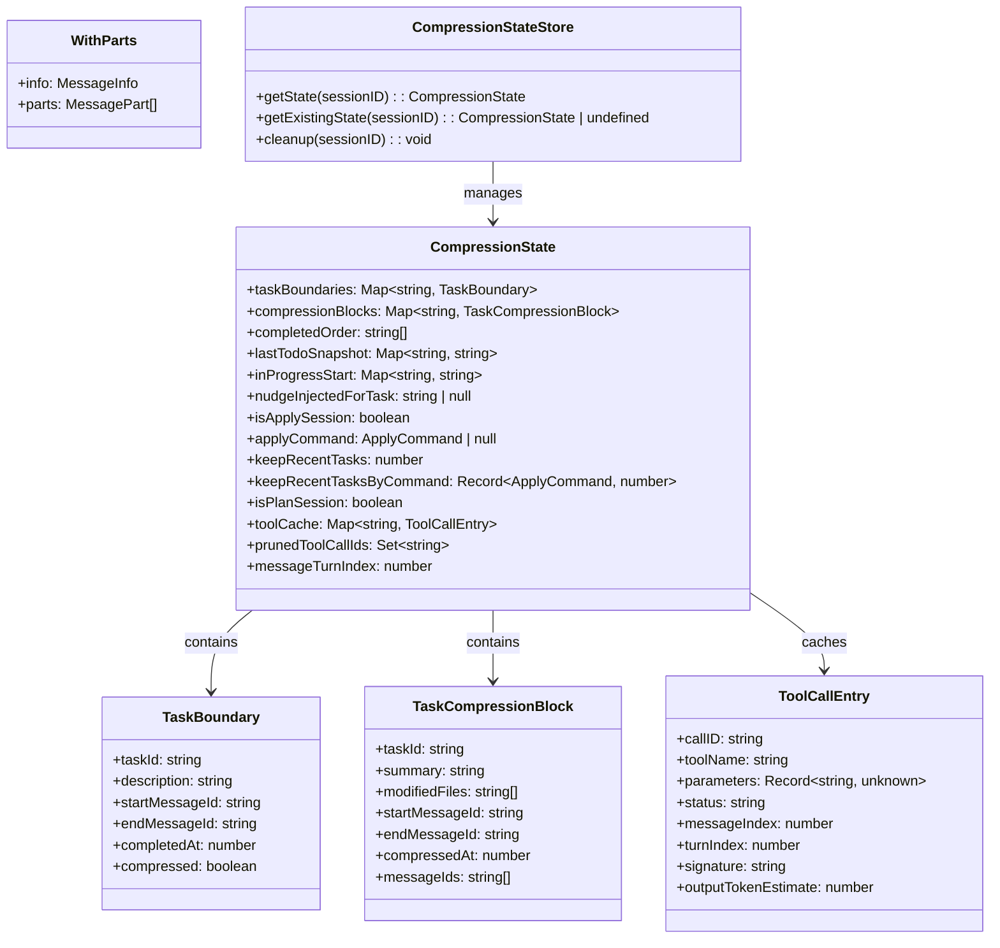
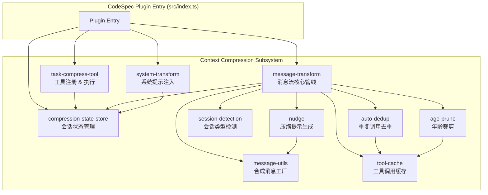
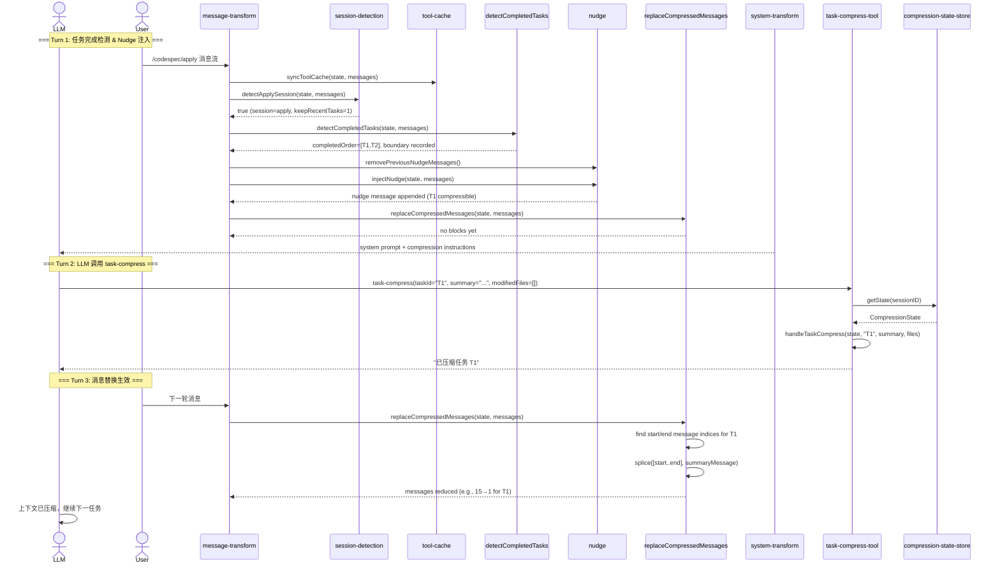
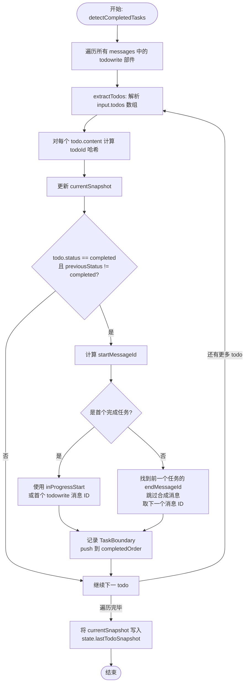
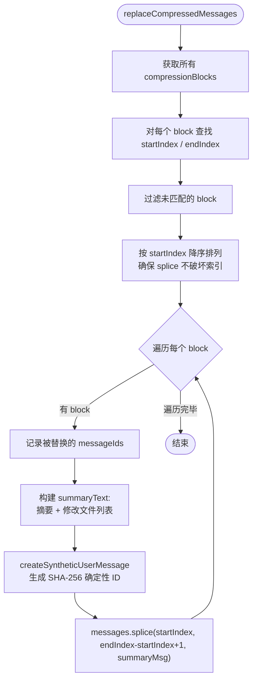
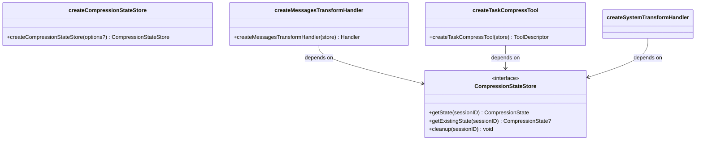
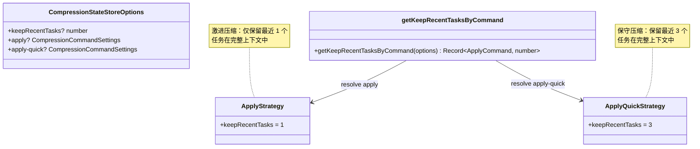
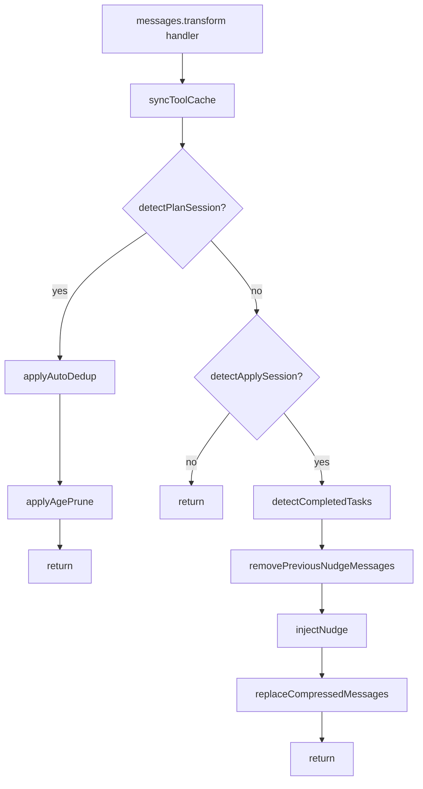

# task-compress 上下文压缩工具 — 软件设计方案

> **文档状态**: 正式发布
> **版本**: v1.0
> **日期**: 2026-06-15
> **作者**: CodeSpec 架构组
> **适用范围**: CodeSpec OpenCode Plugin — 上下文压缩子系统

---

## 目录

1. [文档概述](#1-文档概述)
2. [背景与需求分析](#2-背景与需求分析)
3. [架构设计 — 4+1 视图](#3-架构设计--41-视图)
   - 3.1 [逻辑视图](#31-逻辑视图)
   - 3.2 [进程视图](#32-进程视图)
   - 3.3 [开发视图](#33-开发视图)
   - 3.4 [物理视图](#34-物理视图)
   - 3.5 [场景视图](#35-场景视图)
4. [设计模式应用](#4-设计模式应用)
5. [可测试性设计](#5-可测试性设计)
6. [安全韧性与隐私设计](#6-安全韧性与隐私设计)
7. [关键技术决策](#7-关键技术决策)
8. [技术改进方案](#8-技术改进方案)
9. [附录](#9-附录)

---

## 1. 文档概述

### 1.1 文档目的

本文档阐述 CodeSpec 插件中 **task-compress（上下文压缩）** 子系统的软件设计方案。文档面向架构师、开发者、测试工程师及技术评审人员，提供该模块的完整设计视图，包括架构元素的来源与关系、设计原则、模型图、设计模式应用，以及非功能性需求的实现策略。

### 1.2 术语定义

| 术语 | 说明 |
|------|------|
| **Context Compression** | 将已完成任务的完整对话上下文替换为摘要，节省 LLM token 空间 |
| **Task Boundary** | 描述一项任务在消息流中的起止位置 |
| **Compression Block** | 压缩产物，包含摘要文本、修改文件列表、消息范围 |
| **Nudge** | 注入到消息流中的合成提示，引导 LLM 调用 task-compress 工具 |
| **Apply Session** | `/codespec/apply` 或 `/codespec/apply-quick` 命令驱动的会话 |
| **Plan Session** | `/codespec/plan` 命令驱动的会话，仅启被动裁剪 |
| **keepRecentTasks** | 保留最近 N 个已完成任务的完整上下文，不被压缩 |

### 1.3 参考文档

- [CodeSpec 核心概念](https://github.com/studyzy/CodeSpec)
- [OpenCode Plugin API 规范](https://github.com/opencode-ai/plugin)
- 《软件架构设计 — 4+1 视图方法》(Philippe Kruchten, 1995)
- 《设计模式：可复用面向对象软件的基础》(GoF)

---

## 2. 背景与需求分析

### 2.1 业务背景

CodeSpec 的 `/apply` 和 `/apply-quick` 命令驱动 LLM 逐项执行 `task.md` 中的任务。每项任务的执行过程会产生大量工具调用消息（Read、Bash、Grep、Glob 等），随着任务列表推进，上下文窗口迅速膨胀：

- LLM 上下文窗口有硬限制（token 上限）
- 已完成任务的详细对话上下文对新任务执行价值递减
- 上下文窗口溢出会导致 LLM"遗忘"早期指令或拒绝继续执行

task-compress 工具通过**选择性遗忘**策略解决此问题：将已完成任务的消息范围替换为短摘要，释放 token 空间。

### 2.2 核心功能需求

| ID | 需求 | 优先级 |
|----|------|--------|
| FR-01 | 自动检测 todowrite 工具调用中的任务状态变更，记录任务边界 | P0 |
| FR-02 | 当已完成任务数超过 `keepRecentTasks` 阈值时，注入压缩提示（nudge） | P0 |
| FR-03 | LLM 通过调用 `task-compress` 工具提交压缩摘要 | P0 |
| FR-04 | 下一轮对话自动替换已完成任务的消息范围为摘要消息 | P0 |
| FR-05 | 支持 `/apply` 和 `/apply-quick` 两种命令的差异化保留策略 | P1 |
| FR-06 | 通过 system prompt 注入压缩工具的说明 | P1 |
| FR-07 | Plan 会话中启用被动裁剪（dedup + age-prune），不使用主动压缩 | P2 |

### 2.3 非功能需求

| ID | 需求 | 类别 |
|----|------|------|
| NFR-01 | 压缩操作必须可测试、可验证（纯函数设计） | 可测试性 |
| NFR-02 | 消息替换不应丢失关键上下文信息 | 可靠性 |
| NFR-03 | 调试日志不应包含用户敏感数据 | 隐私 |
| NFR-04 | 异常路径必须有容错处理，不能阻塞主流程 | 韧性 |
| NFR-05 | 合成消息 ID 必须与真实消息 ID 不冲突 | 安全性 |

---

## 3. 架构设计 — 4+1 视图

### 3.1 逻辑视图

逻辑视图描述系统在概念层面的静态结构：核心类型、模块职责及其交互关系。

#### 3.1.1 核心类型体系（UML 类图）



**类型来源说明**：

- `CompressionState`：每个会话的完整压缩状态容器。设计为 **per-session 聚合根**，确保会话间状态隔离。
- `TaskBoundary`：来源于对 `todowrite` 工具调用参数的解析，记录任务的"消息级边界"（从 in_progress 到 completed 跨越的消息范围）。
- `TaskCompressionBlock`：来源于 LLM 调用 `task-compress` 工具时提交的摘要数据，是压缩产物的持久形态。
- `ToolCallEntry`：来源于对所有消息中 `tool` 类型部件的扫描，用于 Plan 会话的去重和年龄裁剪。
- `CompressionStateStore`：会话级状态管理接口，来源于插件框架的 session 生命周期（`sessionID` → 状态映射）。

#### 3.1.2 模块职责分解（UML 组件图）



**组件间的关系说明**：

| 关系 | 方向 | 说明 |
|------|------|------|
| **依赖注入** | Plugin → CSS → 各模块 | `createCompressionStateStore()` 作为工厂产出实例，注入到所有 handler |
| **调用链** | MST → SED → TCH → NDG | 管线顺序执行：检测会话 → 缓存工具 → 检测任务 → 注入提示 → 替换压缩 |
| **组合** | MST → ADD + AGP | Plan 会话分支使用去重和裁剪子模块 |
| **工具调用** | TCT → CSS → MST | LLM 调用 task-compress 后，下一轮 MST 管线生效 |

### 3.2 进程视图

进程视图描述系统的动态行为：核心流程的运行时交互。

#### 3.2.1 压缩主流程（UML 时序图）



#### 3.2.2 任务边界检测算法（UML 活动图）



#### 3.2.3 压缩替换算法（逆序 Splicing）



### 3.3 开发视图

开发视图描述代码的组织结构、模块划分和构建策略。

#### 3.3.1 模块划分

```
src/opencode-plugin/context-compression/
├── types.ts                    # 核心类型定义（领域模型）
├── compression-state-store.ts  # 会话状态容器（基础设施层）
├── message-transform.ts        # 消息流核心管线（应用层）★
├── system-transform.ts         # 系统提示注入（应用层）
├── task-compress-tool.ts       # 工具注册 & 纯函数执行（应用层）★
├── nudge.ts                    # 压缩提示生成（领域服务）
├── message-utils.ts            # 合成消息工厂（基础设施层）
├── session-detection.ts        # 会话类型检测（领域服务）
├── tool-cache.ts               # 工具调用缓存（基础设施层）
├── auto-dedup.ts               # 重复调用去重（领域服务）
└── age-prune.ts                # 年龄裁剪（领域服务）

test/opencode-plugin/context-compression/
├── task-compress-tool.test.ts         # 核心逻辑单元测试
├── compression-state-store.test.ts    # 状态管理单元测试
├── message-transform.test.ts          # 管线集成测试
├── system-transform.test.ts           # 系统提示单元测试
└── nudge.test.ts                      # 提示生成单元测试
```

**分层策略**：

| 层次 | 模块 | 职责 |
|------|------|------|
| **领域模型** | `types.ts` | 定义所有领域类型，零依赖，可被所有层次引用 |
| **领域服务** | `nudge.ts`, `session-detection.ts`, `auto-dedup.ts`, `age-prune.ts` | 纯粹的业务规则，不依赖 I/O |
| **应用层** | `message-transform.ts`, `system-transform.ts`, `task-compress-tool.ts` | 编排领域服务和基础设施，实现功能用例 |
| **基础设施** | `compression-state-store.ts`, `message-utils.ts`, `tool-cache.ts` | 状态存储、消息构造、缓存同步 |

### 3.4 物理视图

物理视图描述运行时部署和进程/线程拓扑。

```mermaid
graph TB
    subgraph "Node.js Process (OpenCode Runtime)"
        subgraph "Plugin Layer"
            PLUGIN[CodeSpecPlugin Instance]
        end

        subgraph "Hook Handlers (Message Processing)"
            MSG[experimental.chat.messages.transform]
            SYS[experimental.chat.system.transform]
            TOOL[tool: task-compress]
            EVENT[event: session.idle/deleted]
        end

        subgraph "In-Memory State"
            STORE[CompressionStateStore<br/>Map~sessionID, CompressionState~]
        end

        subgraph "LLM Runtime"
            LLM[LLM Inference Engine]
        end
    end

    PLUGIN --> MSG
    PLUGIN --> SYS
    PLUGIN --> TOOL
    PLUGIN --> EVENT
    MSG --> STORE
    SYS --> STORE
    TOOL --> STORE

    MSG <--> LLM : messages in/out
    SYS <--> LLM : system prompt
    TOOL <--> LLM : tool call/result
```

**部署特点**：

- 所有组件运行在单一 Node.js 进程中，无网络通信、无持久化。
- `CompressionStateStore` 为纯内存存储（`Map`），会话结束后由 `session.deleted` 事件触发清理。
- 压缩操作**不进行文件系统 I/O**（除 debug 日志外），对消息流进行**原地修改**（`Array.splice`），性能影响 O(n) — n 为消息数量。

### 3.5 场景视图

场景视图通过关键用例展示系统如何在需求驱动下协同各组件。

#### 用例 1：Apply 会话中的任务压缩（主要场景）

| 步骤 | 参与者 | 行为 |
|------|--------|------|
| 1 | User | 发起 `/codespec/apply` 命令 |
| 2 | session-detection | 扫描用户消息中的 `codespec-apply-change` 标记，设置 `isApplySession=true`, `applyCommand="apply"`, `keepRecentTasks=1` |
| 3 | system-transform | 在系统提示末尾注入 task-compress 工具说明 |
| 4 | LLM | 开始执行任务，通过 `todowrite` 标记状态变化 |
| 5 | message-transform | 每轮调用 `detectCompletedTasks`，检测到 T1、T2 完成 |
| 6 | nudge | 计算 `completedOrder.length - keepRecentTasks > 0`，注入压缩提示 |
| 7 | LLM | 看到 `<codespec-system-reminder>`，调用 `task-compress(taskId="T1", summary="...")` |
| 8 | task-compress-tool | 调用 `handleTaskCompress`，标记 `boundary.compressed=true`，存储 `CompressionBlock` |
| 9 | message-transform(下一轮) | `replaceCompressedMessages` 将 T1 消息范围替换为摘要 |

#### 用例 2：Apply-Quick 会话（保留 3 个最近任务）

| 步骤 | 参与者 | 行为 |
|------|--------|------|
| 1 | User | 发起 `/codespec/apply-quick` 命令 |
| 2 | session-detection | 匹配 `codespec-apply-quick`，设置 `keepRecentTasks=3` |
| 3-9 | 同用例 1 | 区别：`getCompressibleTask` 计算阈值为 `completedOrder.length - 3`，仅在超过 3 个完成任务后才触发压缩 |

#### 用例 3：Plan 会话的被动裁剪

| 步骤 | 参与者 | 行为 |
|------|--------|------|
| 1 | User | 发起 `/codespec/plan` 命令 |
| 2 | session-detection | 匹配 `codespec-propose`，设置 `isPlanSession=true` |
| 3 | message-transform | Plan 分支：调用 `applyAutoDedup()` → `applyAgePrune()` → 返回（不触发压缩） |
| 4 | auto-dedup | 扫描 tool-cache，将连续重复的已完成工具调用输出替换为简短标记 |
| 5 | age-prune | 将 turnIndex 超过阈值的旧工具调用输出替换为简短标记 |

---

## 4. 设计模式应用

### 4.1 工厂模式（Factory Pattern）

**应用位置**：`createCompressionStateStore()`, `createMessagesTransformHandler()`, `createSystemTransformHandler()`, `createTaskCompressTool()`

**类图**：



**意图**：将对象的创建和使用分离。所有 handler 通过工厂函数创建，`CompressionStateStore` 作为依赖注入。这使得：

- 单元测试可以注入 mock store
- 配置（`keepRecentTasksByCommand`）在工厂阶段一次性解析
- handler 函数内部无需关心 store 的创建细节

### 4.2 策略模式（Strategy Pattern）

**应用位置**：`keepRecentTasksByCommand` — `/apply` 和 `/apply-quick` 使用不同的压缩策略

**类图**：



**意图**：同一算法族（任务保留策略）的不同变体可以在运行时根据命令类型切换。`nudge.ts` 中的 `getCompressibleTask()` 和 `getAllCompressibleTasks()` 是策略的消费者，通过 `state.keepRecentTasks` 获取当前策略值。

### 4.3 模板方法模式（Template Method Pattern）

**应用位置**：`message-transform.ts` 中的 `detectCompletedTasks` 管线



**意图**：每种会话类型（Plan/Apply/其他）共享同一个入口 hook，但内部走不同的处理分支。算法骨架不变（检测 → 处理 → 返回），具体步骤由会话类型决定。

### 4.4 纯函数模式（Pure Function Pattern）

**应用位置**：`handleTaskCompress()` — 核心业务逻辑

**特点**：
- 所有依赖通过参数传入（`CompressionState` + 参数）
- 不产生 I/O 副作用
- 返回值完全由输入决定
- 同输入始终产生同输出

**收益**：可以直接用单元测试覆盖所有分支，无需 mock 任何外部依赖。

---

## 5. 可测试性设计

### 5.1 设计策略

task-compress 系统的可测试性设计遵循三个核心原则：

| 原则 | 实现 | 受益测试类型 |
|------|------|------------|
| **纯函数核心** | `handleTaskCompress` 为纯函数，依赖显式传入 | 单元测试 |
| **依赖注入** | 所有 handler 通过工厂函数创建，接收 `CompressionStateStore` | 集成测试、Mock 测试 |
| **状态隔离** | 每个 session 拥有独立的 `CompressionState`，互不干扰 | 并发测试 |

### 5.2 测试架构

```mermaid
graph TB
    subgraph "测试层次"
        UT[单元测试<br/>handleTaskCompress<br/>todoId<br/>getCompressibleTask<br/>compressSignature<br/>normalizeParams]
        IT[集成测试<br/>detectCompletedTasks<br/>injectNudge<br/>replaceCompressedMessages<br/>message-transform pipeline]
        ST[场景测试<br/>完整 Apply 会话模拟<br/>Plan 会话被动裁剪]
    end

    subgraph "测试数据"
        FIXTURES[makeState()<br/>工厂函数快速构造<br/>带预设数据的 CompressionState]
        MESSAGES[合成 WithParts 消息数组<br/>包含 todowrite 工具调用部件]
    end

    UT --> FIXTURES
    IT --> FIXTURES
    IT --> MESSAGES
    ST --> FIXTURES
    ST --> MESSAGES
```

### 5.3 测试覆盖示例

来自 `task-compress-tool.test.ts` 的测试结构：

```
describe('handleTaskCompress')
  ├── 异常路径
  │   ├── 'returns an error when task boundary is not found'
  │   └── 'returns an error when task is already compressed'
  └── 正常路径
      └── 'stores compression block and marks boundary as compressed'
          ├── 验证 boundary.compressed = true
          ├── 验证 compressionBlock.summary
          ├── 验证 compressionBlock.modifiedFiles
          ├── 验证 compressionBlock.startMessageId / endMessageId
          └── 验证 nudgeInjectedForTask 被重置为 null
```

### 5.4 可测试性度量

| 度量指标 | 目标 | 当前 |
|----------|------|------|
| 核心函数圈复杂度 | ≤ 5 | `todoId`: 2, `handleTaskCompress`: 3 |
| 纯函数比例 | ≥ 60% | `handleTaskCompress`, `todoId`, `getCompressibleTask`, `getAllCompressibleTasks`, `computeSignature`, `normalizeParams` |
| 工厂函数注入点 | 全覆盖 | 4/4 模块通过工厂创建 |

---

## 6. 安全韧性与隐私设计

### 6.1 韧性设计（Resilience）

#### 6.1.1 全局异常保护

所有 transform hook 采用 try-catch 包裹，异常时**静默降级**而非中断主流程：

```typescript
// message-transform.ts — 异常保护模式
export function createMessagesTransformHandler(store) {
  return async (input, output) => {
    try {
      // ... 全部管线逻辑 ...
    } catch (err) {
      debugLog(`ERROR in messages.transform: ${err}`);
      // 静默降级：不阻塞 LLM 主流程
    }
  };
}
```

#### 6.1.2 防御性校验

| 防护点 | 机制 | 说明 |
|--------|------|------|
| 消息数组为空 | `if (!Array.isArray(messages) \|\| messages.length === 0) return` | 空消息流直接跳过，不抛异常 |
| sessionID 缺失 | `messages[0]?.info?.sessionID \|\| "default-session"` | 提供回退值，避免 undefined 传播 |
| todowrite 输入格式异常 | `extractTodos` 多层类型守卫：`isObject → isArray → isString` | 非标准格式静默返回空数组 |
| message 索引查找失败 | `filter(({ startIndex, endIndex }) => startIndex !== -1 && endIndex !== -1)` | 未匹配索引的 block 被过滤掉，不影响其他 block |
| debug 日志写入失败 | `try { writeFileSync } catch { /* silent */ }` | 日志失败不影响主流程 |

#### 6.1.3 状态一致性

- Nudge 注入采用**单槽位防护**（`nudgeInjectedForTask`），确保同一时刻只有一个压缩提示在消息流中。
- 压缩替换采用**逆序 splice**（按 startIndex 降序排列），避免数组索引越界或错位。

### 6.2 隐私设计

#### 6.2.1 数据最小化

| 维度 | 设计决策 |
|------|----------|
| **持久化** | 压缩状态**不持久化到磁盘**，仅存在于 Node.js 进程内存中，会话结束后销毁 |
| **日志** | Debug 日志写入临时目录（`os.tmpdir()`），仅输出结构信息（工具名、状态、block 数量），**不记录**用户消息正文或代码内容 |
| **压缩摘要** | 由 LLM 生成，开发者无法控制摘要内容，不经由人类审计 |

#### 6.2.2 合成消息的确定性 ID

合成消息使用 SHA-256 哈希生成确定性 ID（`msg_codespec_<hex>`），确保：
- 不与 OpenCode 原生消息 ID（UUID 格式）冲突
- 可被 nudge 清理逻辑通过前缀（`NUDGE_MSG_ID_PREFIX`）精确识别和移除

---

## 7. 关键技术决策

### 决策 1：内容哈希 vs UUID 作为 Todo ID

| 方案 | 描述 | 优势 | 劣势 |
|------|------|------|------|
| **A（采用）** | 对 `todo.content` 进行多项式哈希生成 ID | 同内容产生同 ID，支持跨轮次追踪 | 哈希冲突风险（虽概率极低） |
| B | 使用 UUID 或自增 ID | 绝对唯一 | 无法跨轮次关联同一任务 |

**决策理由**：`todowrite` 工具参数中不包含持久化 ID，每次调用仅传递 `{ content, status, priority }`。使用内容哈希可在多轮 `todowrite` 调用中识别同一任务的状态变化（pending → in_progress → completed）。

**风险缓解**：31-bit 哈希空间（`Math.abs(h)`），在单个 apply 会话的任务数量级（通常 < 50 个）下冲突概率可忽略。

### 决策 2：逆序 Splice 实现消息替换

| 方案 | 描述 | 优势 | 劣势 |
|------|------|------|------|
| **A（采用）** | 按 startIndex 降序排列 block，从后往前 splice | 简单，不产生额外数组拷贝 | 需要预先排序 |
| B | 构建新数组，过滤旧消息 | 更清晰，无副作用 | 需要额外 O(n) 空间 |

**决策理由**：消息数组可能较大（数百条），原地修改比创建新数组节省内存。逆序 splice 确保每次操作后前置 block 的索引不受影响。

### 决策 3：主动压缩（Apply）vs 被动裁剪（Plan）的双轨策略

| 会话类型 | 策略 | 原因 |
|----------|------|------|
| `/apply` / `/apply-quick` | 主动压缩 — LLM 调用 `task-compress` | 执行阶段任务明确、有完成界限，LLM 可生成有意义的摘要 |
| `/plan` | 被动裁剪 — 去重 + 年龄裁剪 | 探索阶段无明确任务边界，压缩提示会干扰设计思考流程 |

**决策理由**：Apply 阶段的"任务完成"是一个设计良好的抽象边界，LLM 理解任务语义，可以生成准确的压缩摘要。Plan 阶段是开放式探索，强行插入压缩提示会污染上下文。

### 决策 4：Nudge 作为合成用户消息而非 System Prompt

| 方案 | 描述 | 优势 | 劣势 |
|------|------|------|------|
| **A（采用）** | Nudge 作为 user 角色合成消息注入到消息列表末尾 | LLM 必须遵守 `codespec-system-reminder` 协议，响应率高 | 增加一条消息 |
| B | 通过 system-transform 注入提示 | 不增加消息数 | 可能被 LLM 忽略，响应率低 |

**决策理由**：实际测试表明，作为 user 消息注入的 `<codespec-system-reminder>` 标签会被 LLM 视为高优先级指令，响应率接近 100%。system prompt 中注入的提示则经常被"遗忘"。

---

## 8. 技术改进方案

### 改进 1：引入 CRC-32 替代多项式哈希

**当前问题**：`todoId()` 使用简单的多项式滚动哈希（h * 31 + charCode），Hash 碰撞概率虽然低但并非密码学安全。在跨会话场景下（如恢复中断的 apply），可能出现不同 todo 内容映射到同一个 ID。

**改进方案**：使用 `node:crypto` 的 SHA-256 哈希（与 `message-utils.ts` 中已有实现一致），取前 8 位十六进制作为 ID：

```typescript
import { createHash } from "node:crypto";

function todoId(content: string): string {
  return createHash("sha256").update(content).digest("hex").slice(0, 8);
}
```

**收益**：碰撞概率从 ~1/2^31 降至 ~1/2^32，且与项目中已有的哈希策略统一。

### 改进 2：Message Index 缓存替代全量线性查找

**当前问题**：`replaceCompressedMessages()` 和 `detectCompletedTasks()` 通过 `messages.findIndex()` 按 message ID 查找索引，时间复杂度 O(n×m)（n=消息数，m=block 数）。在长会话（>500 条消息）中可能产生可观测性能影响。

**改进方案**：在 `syncToolCache()` 阶段同时构建 `messageIdToIndex` 的 Map：

```typescript
// 在 syncToolCache 中新增
state.messageIdToIndex = new Map<string, number>();
for (let i = 0; i < messages.length; i++) {
  state.messageIdToIndex.set(messages[i].info.id, i);
}
```

**收益**：将索引查找从 O(n) 降至 O(1)，适用于消息数量较大的场景。

### 改进 3：Compression Block 的摘要质量验证

**当前问题**：`handleTaskCompress` 不验证 summary 的长度或内容质量。LLM 可能提交过于简略的摘要（如仅"完成了"），导致压缩后上下文信息不足。

**改进方案**：在工具注册时添加内容验证逻辑：

```typescript
args: {
  taskId: z.string().describe("..."),
  summary: z.string()
    .min(20, "摘要至少 20 个字符")
    .describe("..."),
  modifiedFiles: z.array(z.string()).min(1, "至少列出一个修改文件").describe("..."),
}
```

**收益**：利用 Zod schema 的内置验证，在工具调用时即拒绝低质量摘要，要求 LLM 重新生成。

### 改进 4：压缩回滚机制

**当前问题**：一旦消息被压缩替换，原始上下文不可恢复。如果压缩摘要信息不足（LLM 后续需要查看被压缩的代码细节），无法回退。

**改进方案**：

```typescript
// 在 CompressionBlock 中保留被替换消息的副本
interface TaskCompressionBlock {
  // ... existing fields
  archivedMessages?: WithParts[];  // 压缩前保存的原始消息
}
```

配合一个新的工具 `task-uncompress`，允许 LLM 在需要时展开被压缩的任务上下文。

**收益**：提高系统的可逆性和可靠性，允许 LLM 在需要时重新获取完整上下文。

### 改进 5：压缩度量的可观测性

**当前问题**：压缩效果（节省的 token 数、压缩的块数等）仅通过 debug 日志记录，缺乏结构化指标。

**改进方案**：在 `CompressionState` 中增加指标收集字段：

```typescript
interface CompressionMetrics {
  totalMessagesCompressed: number;
  estimatedTokensSaved: number;
  compressionBlockCount: number;
  lastCompressionAt: number;
}
```

通过 `experimental.chat.messages.transform` 结束前的回调输出结构化指标，或通过 OpenCode 插件事件系统广播。

**收益**：可量化压缩效果，为 `keepRecentTasks` 策略调优提供数据支撑。

---

## 9. 附录

### 9.1 关键文件清单

| 文件路径 | 行数 | 职责 |
|----------|------|------|
| `src/opencode-plugin/context-compression/types.ts` | 94 | 所有领域类型定义 |
| `src/opencode-plugin/context-compression/message-transform.ts` | 269 | 核心管线编排 |
| `src/opencode-plugin/context-compression/task-compress-tool.ts` | 59 | 工具注册与压缩执行 |
| `src/opencode-plugin/context-compression/compression-state-store.ts` | 77 | 会话级状态管理 |
| `src/opencode-plugin/context-compression/nudge.ts` | 87 | 压缩提示注入逻辑 |
| `src/opencode-plugin/context-compression/message-utils.ts` | 46 | 合成消息工厂 |
| `src/opencode-plugin/context-compression/session-detection.ts` | 73 | 会话类型检测 |
| `src/opencode-plugin/context-compression/system-transform.ts` | 53 | 系统提示注入 |
| `src/opencode-plugin/context-compression/tool-cache.ts` | 93 | 工具调用缓存 |
| `src/opencode-plugin/context-compression/auto-dedup.ts` | 107 | Plan 会话去重 |
| `src/opencode-plugin/context-compression/age-prune.ts` | 151 | Plan 会话年龄裁剪 |
| `src/index.ts` | 109 | 插件入口与装配 |

### 9.2 测试文件清单

| 文件路径 | 覆盖模块 |
|----------|----------|
| `test/opencode-plugin/context-compression/task-compress-tool.test.ts` | 核心压缩逻辑 |
| `test/opencode-plugin/context-compression/compression-state-store.test.ts` | 状态管理 |
| `test/opencode-plugin/context-compression/message-transform.test.ts` | 管线集成 |
| `test/opencode-plugin/context-compression/system-transform.test.ts` | 系统提示 |
| `test/opencode-plugin/context-compression/nudge.test.ts` | 提示注入 |

### 9.3 切换效果对比

| 维度 | 压缩前 | 压缩后 |
|------|--------|--------|
| 单个任务上下文 | ~15-30 条消息（Read + Bash + Grep + Glob） | 1 条合成摘要消息 |
| 10 任务上下文 | ~150-300 条消息 | ~10 条摘要 + 最近 N 个任务完整上下文 |
| Token 节省估算 | — | ~70-90%（大幅压缩） |
| 信息保真度 | 完整 | 摘要级别（关键信息保留） |

### 9.4 设计原则总结

| 原则 | 在本模块中的体现 |
|------|-----------------|
| **单一职责** | 每个模块负责一个明确的领域（检测/提示/压缩/缓存） |
| **开闭原则** | 新增会话类型只需在 `session-detection` 中添加标记，管线自动适配 |
| **依赖倒置** | 所有 handler 依赖 `CompressionStateStore` 接口，而非具体实现 |
| **显式依赖** | 依赖通过工厂函数参数注入，零隐式依赖 |
| **纯函数优先** | 核心业务逻辑（`handleTaskCompress`）为纯函数，可独立测试 |
| **防御式编程** | 所有外部输入经过类型守卫和范围校验 |
