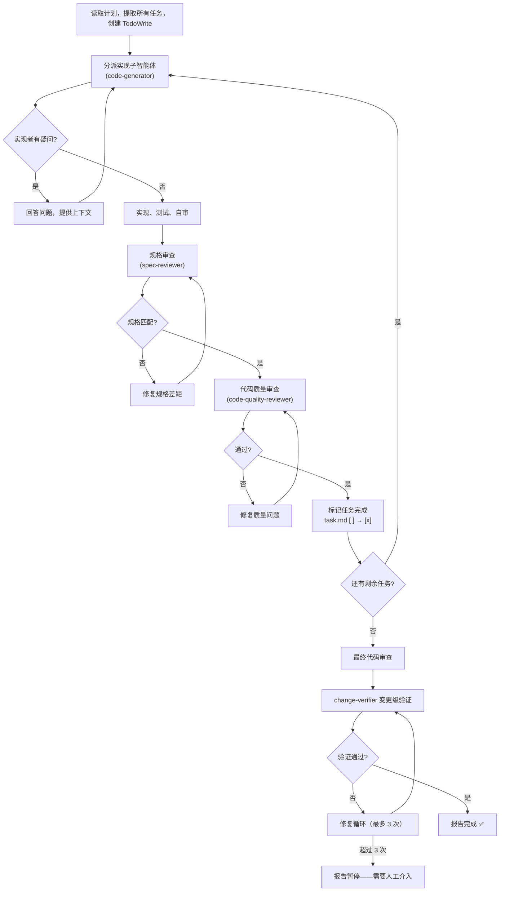
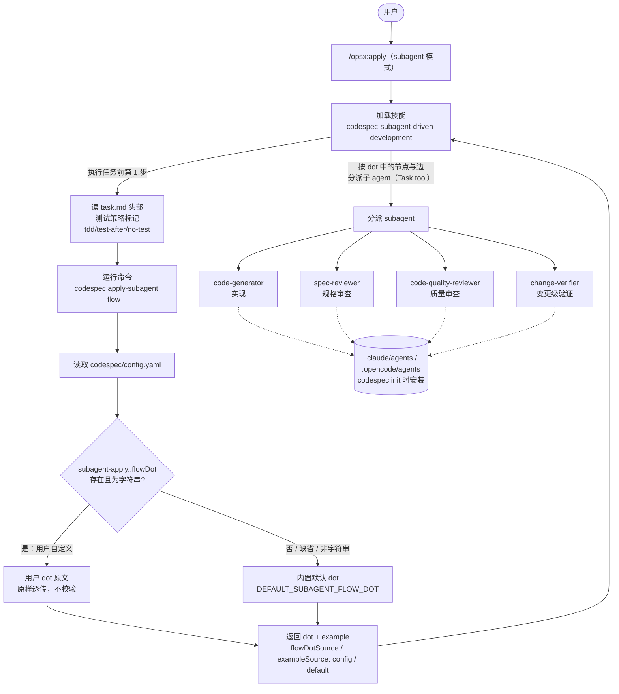
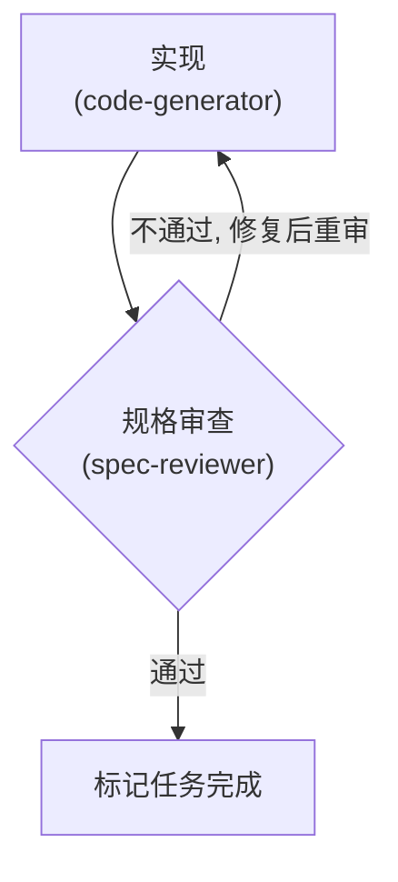
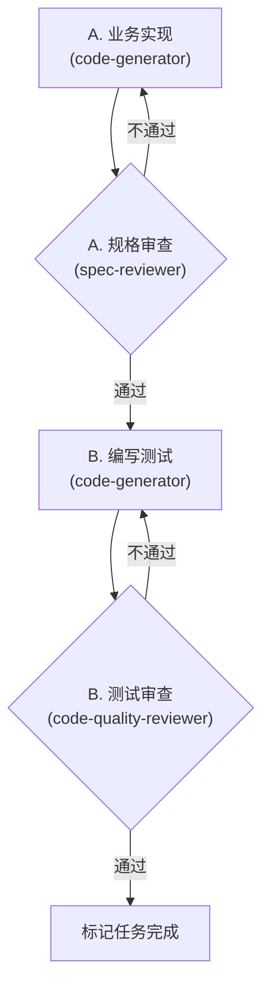

# 定制 subagent 模式的 per-task 执行流程

本文指导你通过 `codespec/config.yaml` 定制 **subagent 模式**（质量优先）下每个任务的执行流程图。适用版本：CodeSpec 1.4.0+。

---

## 背景：两种执行模式

CodeSpec 的 `apply` 命令有两种执行模式，由 `task.md` 头部标记 `> **执行模式**: subagent | main` 决定（未找到标记时默认 `subagent`）：

| 模式 | 别名 | 定制入口 | 命令 |
|------|------|----------|------|
| **subagent 模式** | 质量优先 | `subagent-apply.<测试模式>.flowDot` / `.example`（本文） | `codespec apply-subagent flow --tdd\|--test-after\|--no-test` |
| **main 模式** | 速度优先 | `apply.skipReviewers` | `codespec apply flow` |

两者**互不干扰**：subagent 模式只读 `subagent-apply`，main 模式只读 `apply`。本文只讲 subagent 模式。

### 测试模式

subagent 模式的 per-task 流程图与示例工作流按**测试模式**分别定制，三种模式对应 `task.md` 头部的 `测试策略` 标记：

| 测试模式 | flag | 配置键 | 含义 |
|----------|------|--------|------|
| `tdd` | `--tdd`（默认） | `subagent-apply.tdd` | 先写失败测试再实现（红-绿-重构） |
| `test-after` | `--test-after` | `subagent-apply.test-after` | 先实现再补单元测试 |
| `no-test` | `--no-test` | `subagent-apply.no-test` | 不写任何单元测试，仅编译检查 |

每种模式可分别配置 `flowDot`（流程图）与 `example`（示例工作流），二者各自独立回退到内置默认。三模式的内置默认 `flowDot` 相同（即下文默认链），`example` 也相同。

### subagent 模式的默认流程

开箱即用时（未配置对应模式的 `flowDot`），每个任务走一条固定的审查链，全部任务完成后再做变更级验证：



这条链硬编码在命令的内置默认 dot 里。下面教你如何整张图替换成自己的流程。

## 整体关系一览

`config.yaml` 中的 `subagent-apply.<测试模式>.flowDot` / `.example`、`/apply` 命令、`subagent-driven-development` 技能、以及被分派的 subagent 之间的关系：



关键要点：

- **`/apply`（subagent 模式）**加载 `subagent-driven-development` 技能，由它在分派任何子 agent 前先读 `task.md` 头部 `测试策略` 标记确定模式，再调 `codespec apply-subagent flow --<mode>` 取回该模式的 dot 流程图与示例工作流，然后严格按图分派。
- **`config.yaml` 的 `subagent-apply.<mode>.flowDot` / `.example` 是定制点**：有值就原样透传用户内容，无值回退内置默认。`flowDot` 与 `example` 各自独立解析，可只覆盖其中一个。改这里即改变整张流程图或示例。
- **subagent 就是 init 安装的 agent**：dot 里引用的每个角色（`code-generator` 等）对应 `.claude/agents/` 或 `.opencode/agents/` 下的一个 agent 文件，技能按节点名用 Task tool 分派它们。

---

## 定制思路：直接写 dot 原文

CodeSpec **不**提供"勾选阶段"式的死板配置，而是让你在 `config.yaml` 里**直接写 graphviz dot 原文**定义每个任务的流程图。命令原样透传这段 dot，不做任何校验、不生成步骤列表，由执行 agent 自行解析图中的节点与边。

这样的好处：

- **最自由**——可以增删任意审查节点、改顺序、加分支、拆多阶段。
- **所见即所得**——你写什么，agent 就按什么执行；图中没有的审查不会被凭空添加，图中有的审查不会被跳过。
- **对称**——与 main 模式 `codespec apply flow` 同样是"运行时查流程图"的模式。

---

## 三步接入

### 第 1 步：查看当前流程

不带 flag 时默认按 `tdd` 模式返回：

```bash
codespec apply-subagent flow            # 默认 tdd
codespec apply-subagent flow --tdd      # 显式 tdd
codespec apply-subagent flow --test-after
codespec apply-subagent flow --no-test
```

> 三个 flag 互斥，同时指定多于一个会报错。

输出形如：

```
## subagent 模式执行流程

**测试模式：** tdd
**流程图来源：** 未配置 subagent-apply.tdd.flowDot，使用内置默认流程
**示例工作流来源：** 未配置 subagent-apply.tdd.example，使用内置默认示例

### 流程图
```dot
digraph process {
  ...
}
```

### 示例工作流
```
你：我正在使用子智能体驱动开发来执行这个计划。
...
```
```

加 `--json` 可供 AI 代理直接消费：

```bash
codespec apply-subagent flow --change add-dark-mode --no-test --json
```

返回 `{ changeName, mode, flowDot, flowDotSource, example, exampleSource }`，其中 `flowDotSource` / `exampleSource` 为 `"config"`（使用了你的配置）或 `"default"`（回退到内置默认），二者相互独立。

### 第 2 步：在 config.yaml 写入 dot / example

编辑 `codespec/config.yaml`，新增顶层键 `subagent-apply`（注意：是顶层独立段，**不要**写在既有的 `apply:` 下面），按测试模式分键：

```yaml
subagent-apply:
  tdd:
    flowDot: |-
      digraph process {
        rankdir=TB;
        ...
      }
    example: |-
      你：示例工作流正文……
      完成！
  test-after:
    flowDot: |-
      ...
  no-test:
    flowDot: |-
      ...
```

要点：

- 每个模式键下有 `flowDot`（流程图）与 `example`（示例工作流）两个**可选**字符串字段，各自独立回退到内置默认。
- 字符串多行用 YAML block scalar。推荐用 `|-`（strip 尾随换行），避免末尾多一个空行。
- `flowDot` 内容是**合法的 graphviz dot**即可，CodeSpec 不校验内容、不解析 agent 名；`example` 是给 agent 参照的示例正文，原样透传。
- 缺省（某模式整段不写、或某字段留空、或值为非字符串）→ 该字段回退到内置默认并告警；另一字段不受影响。
- 只想改某个模式的流程图、不想动示例（或反之）时，只写其中一个字段即可。

> 提示：`codespec init` 生成的 `config.yaml` 里已经内置了一段**被注释的默认模板**（以 `tdd` 为例展开了默认 `flowDot` + `example`，`test-after` / `no-test` 给了占位提示），取消注释即得默认行为，可直接在其上修改，无需从零手写。

### 第 3 步：验证

```bash
codespec apply-subagent flow --tdd        # 验证你配置的模式
```

确认"流程图来源 / 示例工作流来源"行变为 `config.yaml subagent-apply.tdd.flowDot（用户自定义）` 等，且内容是你写的。若仍显示"使用内置默认"，检查 YAML 缩进与 `|-` 是否正确、模式键名是否为 `tdd` / `test-after` / `no-test`。

---

## 定制示例

### 示例 1：跳过代码质量审查（仅保留规格审查），仅对 tdd 模式生效

```yaml
subagent-apply:
  tdd:
    flowDot: |-
      digraph process {
        rankdir=TB;
        "实现 (code-generator)" [shape=box];
        "规格审查 (spec-reviewer)" [shape=diamond];
        "标记任务完成" [shape=box];
        "实现 (code-generator)" -> "规格审查 (spec-reviewer)";
        "规格审查 (spec-reviewer)" -> "标记任务完成" [label="通过"];
        "规格审查 (spec-reviewer)" -> "实现 (code-generator)" [label="不通过, 修复后重审"];
      }
```

对应流程图：



### 示例 2：为 test-after 拆分为"业务实现 / 测试验证"两阶段

每个任务先走业务实现 + 业务审查，再走测试编写 + 测试审查（适合 `test-after`，故写在 `test-after` 键下）：

```yaml
subagent-apply:
  test-after:
    flowDot: |-
      digraph process {
        rankdir=TB;

        // A 阶段：业务实现
        "A. 业务实现 (code-generator)" [shape=box];
        "A. 规格审查 (spec-reviewer)" [shape=diamond];

        // B 阶段：测试验证
        "B. 编写测试 (code-generator)" [shape=box];
        "B. 测试审查 (code-quality-reviewer)" [shape=diamond];

        "标记任务完成" [shape=box];

        "A. 业务实现 (code-generator)" -> "A. 规格审查 (spec-reviewer)";
        "A. 规格审查 (spec-reviewer)" -> "A. 业务实现 (code-generator)" [label="不通过"];
        "A. 规格审查 (spec-reviewer)" -> "B. 编写测试 (code-generator)" [label="通过"];
        "B. 编写测试 (code-generator)" -> "B. 测试审查 (code-quality-reviewer)";
        "B. 测试审查 (code-quality-reviewer)" -> "B. 编写测试 (code-generator)" [label="不通过"];
        "B. 测试审查 (code-quality-reviewer)" -> "标记任务完成" [label="通过"];
      }
```

`example` 同理可在该模式下单独覆盖（`test-after.example:`），不写则回退内置默认示例。

对应流程图：



> 注意：图中引用的 agent（节点名里括号标注的角色）**必须已随 `codespec init` 安装**，否则执行时按名分派子 agent 会找不到对应 agent。

---

## 可用 agent

`codespec init` 自动安装、可在 dot 中按名引用的 agent：

| agent 名 | 角色 |
|----------|------|
| `code-generator` | 实现子智能体（写业务代码 / 测试） |
| `spec-reviewer` | 规格合规审查 |
| `code-quality-reviewer` | 代码质量审查（编译 + 测试通过） |
| `change-verifier` | 变更级验证 |
| `concept-clarify` | 概念澄清 |

> `dt-code-generator`、`dt-code-quality-reviewer` 两个**测试专用** agent 暂未开放，`init` 不会自动创建。如需在 dot 中引用它们，需先由维护者重新接入（见维护者说明）。当前请用上表的 `code-generator` / `code-quality-reviewer` 承担测试阶段工作。

---

## 执行 agent 如何使用你的流程

`codespec-subagent-driven-development` 技能在执行任何任务前的**第一步**就是先读 `task.md` 头部的 `测试策略` 标记确定模式，再运行 `codespec apply-subagent flow --<mode>`，读取返回的 dot 与 example，然后严格按图执行：

- 只为图中出现的 agent 分派子智能体；
- 只为图中出现的审查节点创建 TodoWrite 条目；
- 不添加图中没有的审查步骤，也不跳过图中有的审查步骤；
- 返回的 `example` 作为本批示例工作流供参照，不再硬编码于技能中。

因此你改 `config.yaml` 后**无需重启或重新 init**，下一次 `apply`（subagent 模式）即生效。

---

## 常见问题

**Q：改了 `flowDot` 但命令仍返回默认流程？**
检查：①YAML 缩进是否正确（`flowDot` 在模式键 `tdd` / `test-after` / `no-test` 下、模式键在 `subagent-apply` 下）；②是否用了 `|-` 而非 `|`（不致命，但会多一个尾随换行）；③值是否是非字符串（如写成 `flowDot: 123`），此时会告警并回退默认；④是否查的是对应模式（`--tdd` 只读 `subagent-apply.tdd`，与 `test-after` / `no-test` 互不影响）。

**Q：三种模式默认流程一样，区分模式有什么意义？**
默认值确实相同（开箱即用三模式等价）。区分模式的意义在于：你可以**只为某种测试策略定制流程**，例如给 `no-test` 配一份去掉测试节点的精简流程，而 `tdd` / `test-after` 保留完整审查链。技能会按本批 `task.md` 的 `测试策略` 自动取对应模式的流程。

**Q：`example` 是干什么的？必须配置吗？**
`example` 是给执行 agent 参照的示例工作流正文（控制者与子智能体的交互节奏样例）。**可选**，缺省回退内置默认示例。`example` 与 `flowDot` 独立配置，可只改其一。

**Q：dot 写错了会怎样？**
CodeSpec 不校验 dot 语法。语法错误会导致执行 agent 解析失败，责任在作者。建议先用 `codespec apply-subagent flow --<mode>` 确认输出，再实际跑 `apply`。

**Q：subagent 模式和 main 模式的配置会互相影响吗？**
不会。`subagent-apply` 只被 `codespec apply-subagent flow` + subagent 模式消费；`apply.skipReviewers` 只被 `codespec apply flow` + main 模式消费。两段配置可同时存在、各自独立。

**Q：旧版的 `subagent-apply.taskFlow.flowDot` 还能用吗？**
不能。该结构已废弃，命令只认新的 `subagent-apply.<mode>.flowDot` / `.example` 三模式结构。若 `config.yaml` 中仍存在 `taskFlow` 键，解析时会输出一条废弃告警，请迁移到新结构。

**Q：如何切回默认流程？**
删除 `config.yaml` 中的 `subagent-apply` 整段（或注释掉），命令即回退内置默认。

---

## 另请参阅

- [自定义](customization.md) —— 项目配置、自定义 schema 等通用定制
- [工作流](workflows.md) —— apply 双模式总览
- [CLI 参考](cli.md) —— 命令清单