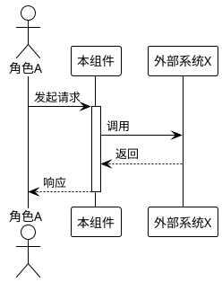

## ADDED Requirements

> 新增的业务规则和能力

### 1.X [新功能模块名称]

#### 业务规则

1. **规则名称**：[详细描述，使用"必须/禁止/应当"]
    - **验收条件**：[触发场景] → [预期行为]
    - **验收条件**：[触发场景] → [预期行为]

2. **规则名称**：[详细描述]
    - **验收条件**：[触发场景] → [预期行为]

3. **禁止项**：[详细描述]
    - **验收条件**：[触发场景] → [预期行为]

#### 交互流程

使用 PlantUML 描述组件间的交互

#### 异常场景

描述异常情况和处理方式

1. **场景：[异常场景名称]**
    - **触发条件**：[描述]
    - **系统行为**：[描述]
    - **用户感知**：[错误码或提示]

---

## MODIFIED Requirements

> 修改的现有业务规则（需写出完整修改后的内容）

### 1.Y [现有功能模块名称]

#### 业务规则

1. **规则名称**：[修改后的完整描述]  ← (原为: [原描述])
    - **验收条件**：[触发场景] → [新预期行为]

---

## REMOVED Requirements

> 删除的业务规则

### 1.Z [要删除的功能模块名称]

**删除原因**：[说明为什么删除此功能]

**迁移路径**：[如适用，说明用户如何适应此删除]

---

## 数据约束变更

### ADDED

#### 2.X [新领域对象]

1. **字段1**：[约束描述]
2. **字段2**：[约束描述]

### MODIFIED

#### 2.Y [现有领域对象]

1. **字段1**：[修改后约束]  ← (原为: [原约束])

---

## 术语变更

### ADDED

**新术语名称**
: [术语定义]

### MODIFIED

**现有术语名称**
: [修改后定义]  ← (原为: [原定义])

---

## 合并检查清单

- [ ] ADDED 内容已添加到对应章节
- [ ] MODIFIED 内容已替换原有内容
- [ ] REMOVED 内容已从 SPEC.md 中删除
- [ ] 章节编号已重新整理
